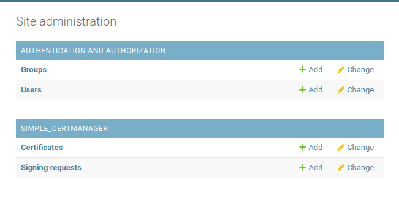
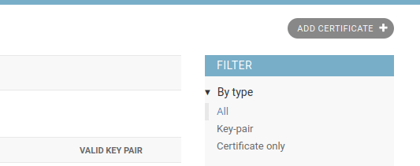
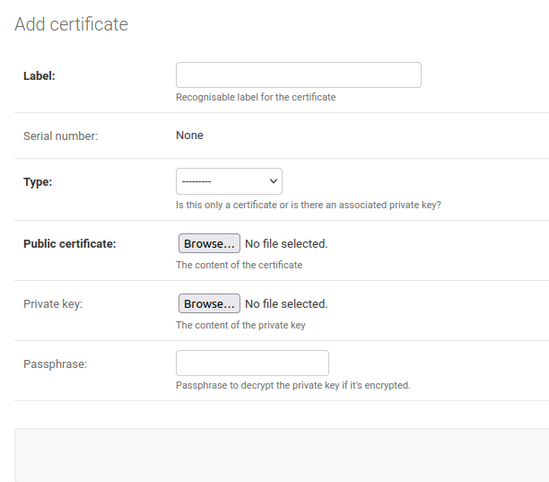
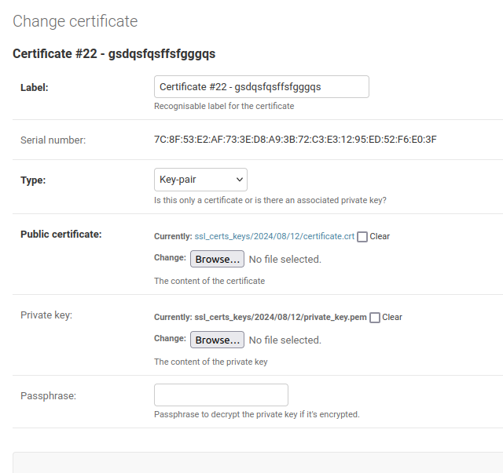
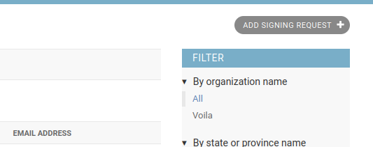
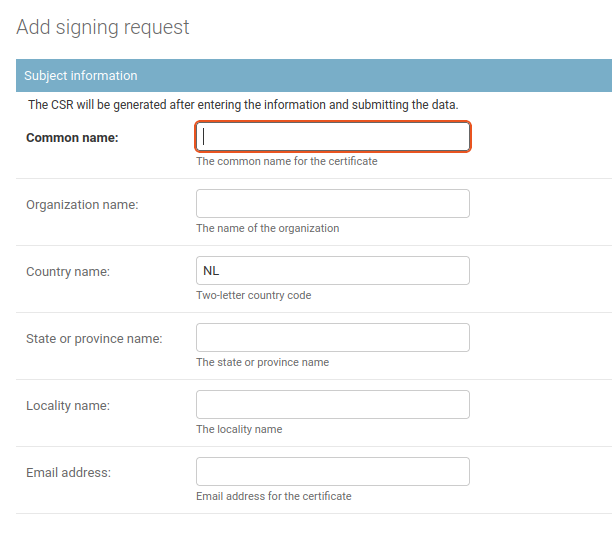
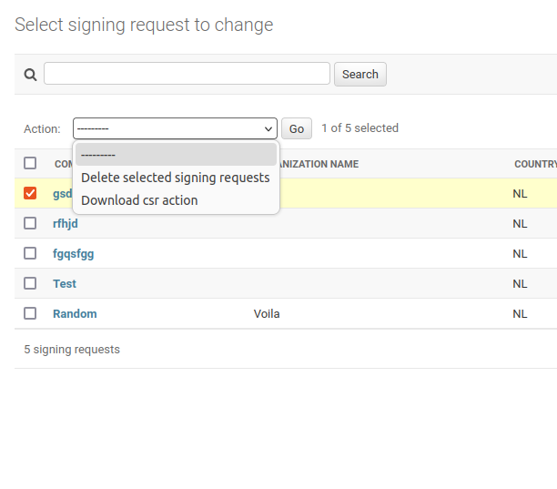
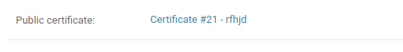

Upload a Public Certificate
---------------------------

There is two ways to upload a public certificate:

Through the Certificates section
~~~~~~~~~~~~~~~~~~~~~~~~~~~~~~~~

To upload a public certificate (TLS/SSL), you can use the **Django admin**.

1. Go to the Django admin

2. Open the "Certificates" section.

3. On the top right, click the "ADD CERTIFICATE" button.

4. Fill in the `label`, `type` and upload the certificate delivered from 
   your Certificate Authority (CA).
   Certificate must be a valid PEM file.

5. Save the instance, the certificate will be verified and stored in the instance.

Through the Signing Requests section
~~~~~~~~~~~~~~~~~~~~~~~~~~~~~~~~~~~~

To upload a public certificate (TLS/SSL), you can first create a Certificate Signing Request (CSR)
and then upload the signed certificate.

1. Go to the Django admin

2. Open the "Signing requests" section.

3. On the top right, click the "ADD SIGNING REQUEST" button.

1. Fill in the Subject Information section of the instance and save it.

5. *Optional* Once saved, you can download the CSR file from the instance.
   You can also get it from the admin list view by selecting the CSR 
   that you want to download and clicking the "Download CSR" action.

6. Upload the dowloaded CSR to the Certificate Authority (CA) to get it signed.
7. Once signed, you can upload the signed certificate to the instance.
   Certificate must be a valid PEM file.

8. The CSR will be verified and the certificate will be stored in the instance.

9.  Once saved, the instance won't be editable and display the link to the certificate.

